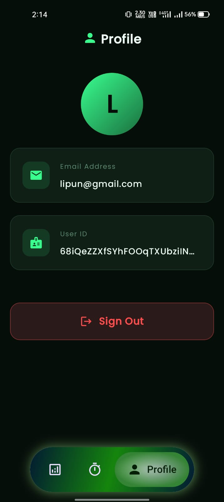
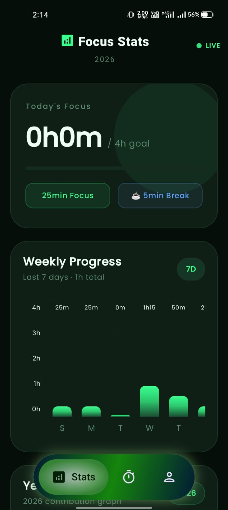
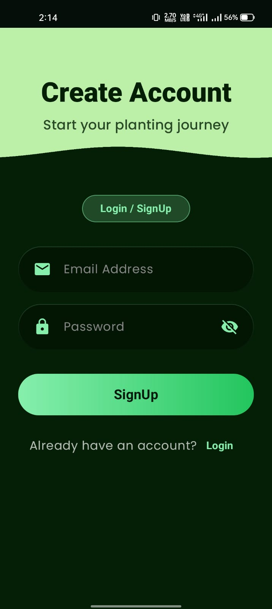

<div align="center">

# 🌳 Sadhana: Cultivate Your Focus

**Reclaim your time. Grow your forest. Master your focus.**

[](https://android.com)
[](https://kotlinlang.org)
[](https://developer.android.com/compose)
[](https://firebase.google.com)
[](LICENSE)

[Download APK](https://github.com/lipun-dev/Sadhana/releases/download/initial_release/app-debug.apk) · [Report Bug](https://github.com/lipun-dev/sadhana/issues) · [Request Feature](https://github.com/lipun-dev/sadhana/issues)

</div>

---

## 📖 Overview

**Sadhana** is a productivity-centric Android application designed to help users reclaim their time from digital distractions and social media addiction. Built with **Jetpack Compose** and **Kotlin**, Sadhana gamifies the concept of *digital detox*.

> 🌱 Plant a virtual tree when you start focusing.
> 🔥 The tree **withers and dies** if you leave the app.
> 🌲 Complete your session and watch your forest grow.

By combining the **Pomodoro Technique** with visual negative reinforcement (loss of progress) and positive reinforcement (growth statistics), Sadhana empowers users to build better work habits — one session at a time.

---

## ✨ Features

| Feature | Description |
|---|---|
| 🍅 **Pomodoro Timer** | Classic 25-min focus + 5-min break productivity loop |
| 🌲 **Forest Gamification** | Plant trees, grow a forest, lose it all if you get distracted |
| 🛡️ **Distraction Shield** | System overlay fires instantly if you try to leave |
| 📊 **Analytics Dashboard** | Weekly & yearly stats to track your focus trends |
| 🔐 **Cloud Sync** | Firebase-backed — your forest follows you across devices |

### 🌲 Forest Gamification — How It Works

- **Plant:** Start the timer to plant a seed 🌱
- **Grow:** Stay in the app for the full session and your tree matures 🌳
- **Wither:** Leave the app during a session → your tree **dies instantly** 💀
- **Forest Garden:** Every completed session permanently adds a tree to your garden

---

## 📸 Screenshots

<div align="center">

| Home / Forest | LoginScreen | ProfileScreen | Statistics | SignupScreen
|:---:|:---:|:---:|:---:|:---:|
|  |  |  |  |  |

</div>

---

### 🎥 App Demo

<div align="center">

<video src="WhatsApp Video 2026-02-28 at 2.mp4" controls width="300"></video>


</div>

---

## 🛠️ Tech Stack

Sadhana is built using modern Android development practices following the [Recommended Architecture Guide](https://developer.android.com/topic/architecture).
```
📦 Sadhana
 ┣ 🗣️  Language        → Kotlin
 ┣ 🎨  UI Toolkit      → Jetpack Compose (Material 3)
 ┣ 🏗️  Architecture    → MVVM (Model-View-ViewModel)
 ┣ 🔥  Auth            → Firebase Authentication
 ┣ ☁️  Database        → Cloud Firestore
 ┣ ⚡  Async           → Kotlin Coroutines & Flow
 ┣ 🧭  Navigation      → Jetpack Compose Navigation
 ┗ 💉  DI              → Hilt
```

---

## 🚀 Getting Started

### Prerequisites

- [Android Studio Hedgehog](https://developer.android.com/studio) or newer
- JDK 17
- A [Firebase](https://firebase.google.com) account

### 1. Clone the Repository
```bash
git clone https://github.com/lipun-dev/sadhana.git
cd sadhana
```

### 2. Firebase Setup ⚠️ *Required*

> The app will **not build** without this step.

1. Go to the [Firebase Console](https://console.firebase.google.com/) and create a new project
2. Enable **Authentication** → Email/Password or Google Sign-In
3. Create a **Firestore Database**
4. Download the `google-services.json` file from **Project Settings**
5. Place it inside the `app/` directory:
```
sadhana/
└── app/
    └── google-services.json   ← place it here
```

### 3. Build & Run

1. Open the project in **Android Studio**
2. Wait for Gradle sync to complete
3. Run on an emulator or physical device ▶️

---

## 📱 Usage
```
1. 🔐 Sign Up / Login     → Create an account to save your forest
2. 🌱 Select a Tree       → Choose your tree type (cosmetic)
3. ▶️  Start Focus        → 25-minute timer begins — stay in the app!
4. ☕ Take a Break        → 5-minute break after each session
5. 📊 View Your Stats     → Profile tab → see your full productivity history
```

---

## 🤝 Contributing

Contributions make the open-source community an incredible place to learn, inspire, and create. Any contributions are **greatly appreciated**.
```bash
# 1. Fork the Project
# 2. Create your Feature Branch
git checkout -b feature/AmazingFeature

# 3. Commit your Changes
git commit -m 'Add some AmazingFeature'

# 4. Push to the Branch
git push origin feature/AmazingFeature

# 5. Open a Pull Request 🎉
```

---

## 📄 License

Distributed under the MIT License. See [`LICENSE`](LICENSE) for more information.

---

## 📧 Contact

**Lipun Das** — slipundas8888@gmail.com

🔗 Project Link: [https://github.com/lipun-dev/sadhana](https://github.com/lipun-dev/Sadhana)

---

<div align="center">

Made with 💚 and lots of focused sessions 🌳

⭐ **Star this repo if Sadhana helped you focus!** ⭐

</div>
